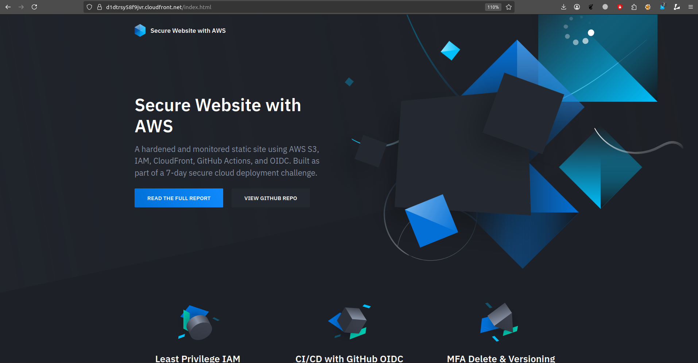

# Secure Static Website on AWS
### A 7-day challenge to deploy a production-grade, hardened site

A secure, scalable, and fully automated static website hosted on AWS using best practices for IAM, CI/CD, and cloud security. No public bucket access, no hardcoded secrets, and full monitoring coverage.

- Built in 4 days as part of a **7-day plan**  
- Focus: IAM, OIDC CI/CD, S3, CloudFront, WAF, Logging & Monitoring  
- Technologies: S3, CloudFront, IAM, GitHub Actions, OIDC, WAF, CloudTrail, Node.js 18+, AWS CLI v2

🌐 **Live Website**: https://d1dtrsy58f9jvr.cloudfront.net/index.html

📄 [Read the full report](./report/report.md)

## Architecture Diagram

## Deployment Pipeline

1. Push changes to `main` on GitHub
2. GitHub Actions is triggered:
   - Linting for HTML and JS
   - Uploads files to S3 using **OIDC IAM Role**
3. CloudFront automatically serves updated content

_No AWS access keys stored or rotated manually._

## Features & Security Controls

| Area          | Implementation Highlights                                                                 |
|---------------|--------------------------------------------------------------------------------------------|
| **IAM**        | Scoped roles per function: deployer (CI), developer (write-only), viewer (read-only)     |
| **CI/CD**      | GitHub Actions using **OIDC**, no secrets stored                                          |
| **S3**         | Private bucket with **OAC** (Origin Access Control), MFA delete, versioning              |
| **CloudFront** | HTTPS-only, **WAF with OWASP rules**, User-Agent restricted                              |
| **Headers**    | Secure headers: CSP, X-Frame-Options, HSTS, XSS Protection                               |
| **Monitoring** | CloudTrail, CloudFront logs, S3 access logs, SNS for alerting          

## Security Validations Performed

The website is designed to be secure by default and not accessible publicly, with the following validations performed:

✅ **S3 direct access blocked** (`403 Access Denied`)\
✅ **Headers present** via `curl -i`\
✅ **Least privilege enforced** (tested role access restrictions)\
✅ **OIDC role restricted** to GitHub org/repo/branch\
✅ **MFA delete tested** for versioned content

## Monitoring & Logging

- **CloudTrail**: Logs all management events (org-wide) to a dedicated S3 bucket.
- **Access Logs**: S3 and CloudFront logs stored in a central bucket (`secure-website-access-logs`).
- **Alerting**: EventBridge → SNS topic for security findings (e.g., GuardDuty).
- **Budget Guardrail**: AWS Budget set to €1.00 with email alerts.

Covers both visibility and incident response with minimal cost overhead.

