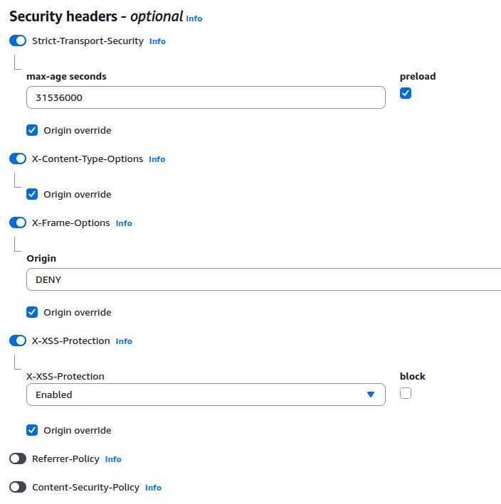

# Secure Static Website on AWS

This report documents the creation of a secure, production-ready static website hosted on AWS, designed to showcase cloud security best practices using S3, CloudFront, IAM, GitHub Actions (OIDC), monitoring, and hardening techniques.
The configuration implements modern security best practices, emphasizing:

- Principle of least privilege for all access
- Access control enforced via IAM roles and bucket policies
- Encryption of data in transit and at rest
- Security headers (CSP, HSTS, XSS protection)
- Secure CI/CD pipeline using GitHub Actions
- Continuous monitoring and manual security testing

## Project Plan

Over 7 days, the objective was to build a secure static website on AWS, adhering to industry-leading security and automation standards with a setup budget. The plan included:

> Day 1 – Project Setup, Static Hosting & Budget Setup\
> Day 2 – IAM & Least Privilege  \
> Day 3 – Automation with GitHub Actions  \
> Day 4 – CloudFront & TLS  \
> Day 5 – Logging & Monitoring  \
> Day 6 – Hardening  \
> Day 7 – Documentation & CV Integration

For each day, I had previously delegated some tasks that I needed to complete. This way, I could adapt as necessary.

## Execution Timeline & Methodology

The implementation of this secure static website followed a structured 7-day plan. Each phase focused on incremental improvements in deployment, access control, automation, and security posture. Below is a summary of the development lifecycle and key decisions:

#### **Day 1 – Project Setup, Static Hosting & Budget Setup**
- Initialized the project repository and selected a lightweight HTML/CSS/JS template.
- Created a private Amazon S3 bucket (`secure-website-lrccosta`) to store the site files.
- Public access was explicitly blocked, enforcing a private-by-default posture.
- Set up an AWS budget with a 1€ threshold and configured an alert to be sent to my email address.

**Security Considerations:**
- Static website hosting was disabled; all content delivery would be handled through CloudFront to prevent direct access.
- Budget alerting helps prevent unexpected AWS charges during development and testing.

---

#### **Day 2 – Identity & Access Management (IAM)**
- Defined three roles using web identity federation:
  - **CI/CD Role**: Limited to deploy operations via GitHub Actions.
  - **Developer Role**: Write-only access restricted by IP/UserAgent.
  - **Viewer Role**: Read-only access to selected objects.

**Security Considerations:**
- Used fine-grained IAM policies with contextual conditions (`aws:SourceIp`, `aws:UserAgent`).
- Validated all role assumptions using the AWS Policy Simulator.

---

#### **Day 3 – CI/CD Pipeline via GitHub Actions**
- Developed a GitHub Actions workflow to:
  - Lint HTML and JavaScript using ESLint and HTMLHint.
  - Deploy static assets to S3 using OIDC-authenticated role assumption.

**Security Considerations:**
- No secrets stored in the repository.
- `sts:AssumeRoleWithWebIdentity` was used with conditions scoping execution to the `main` branch and specific repository.

---

#### **Day 4 – CDN & TLS Configuration**
- Configured CloudFront to serve content from the S3 bucket using an **Origin Access Control (OAC)**.
- Enforced HTTPS with a default certificate issued by ACM in `us-east-1`.
- Attached AWS WAF with managed rules aligned with OWASP Top 10.

**Security Considerations:**
- Blocked direct access to S3; content only available via CloudFront.
- Enhanced protection via Web ACLs to mitigate XSS, SQLi, and common misconfiguration attacks.

---

#### **Day 5 – Logging & Visibility**
- Activated CloudTrail for all management events across the AWS Organization.
- Configured S3 and CloudFront to send access logs to a dedicated bucket (`secure-website-access-logs`).
- Created an SNS Topic and EventBridge Rule for forwarding GuardDuty findings (even though GuardDuty was not activated due to cost constraints).

**Security Considerations:**
- Ensured centralized logging for auditability.
- Bucket policies were tailored to allow only necessary services to write logs.

---

#### **Day 6 – Security Hardening**
- Applied strict HTTP response headers using CloudFront Response Headers Policy:
  - `Content-Security-Policy`
  - `Strict-Transport-Security`
  - `X-Frame-Options`
  - `X-Content-Type-Options`
  - `X-XSS-Protection`
- Enabled **versioning and MFA delete** on the S3 bucket.
- Refined bucket policy to only allow access from CloudFront with verified `User-Agent`.

**Security Considerations:**
- Prevented direct S3 access and enabled rollback via versioning.
- Ensured header-level security to protect end users from clickjacking, XSS, and MIME sniffing.

---

#### **Day 7 – Documentation & CV Integration**
- Generated detailed documentation including:
  - IAM policy samples
  - GitHub workflow definition
  - Cloud architecture diagram
  - Logging and monitoring setup
  - Justifications for security design decisions
- Published code and architecture to GitHub for transparency and portfolio purposes.

**Outcome:**
> The result is a production-grade, cost-efficient, and secure static web hosting pipeline, integrating S3, CloudFront, IAM, GitHub Actions, and optional WAF/GuardDuty services — deployable and extensible for future environments.


## Execution

### Day 1

On Day 1, the project was initialized by selecting a static website template and deploying it to a secure Amazon S3 bucket. This established the foundation of the storage layer in the architecture.


- **Bucket name:** `secure-website-lrccosta`
- **Region:** `eu-west-2`
- **Permissions:** Blocked all public access

The static files were uploaded via AWS CLI:
```bash
aws s3 cp ./site/ s3://secure-website-lrccosta/ --recursive
```

To validate storage usage:
```bash
aws s3 ls s3://secure-website-lrccosta --recursive --human-readable --summarize
```
This setup forms the storage layer of the architecture.

#### Cost Monitoring – Budget Alert

To prevent unexpected costs during development, a budget alarm was created in the AWS Billing Dashboard:

- Budget Name: StaticSiteBudget
- Monthly Threshold: €1.00
- Notification Type: Actual cost
- Email Notification: Sent to personal email (configured via AWS Budgets > Alerts)

This alert ensures early visibility if resource usage exceeds expected free-tier or baseline limits, a key step in keeping the project cost-efficient from the outset.

### Day 2

On Day 2, the focus shifted to secure automation. To eliminate the use of long-lived credentials in CI/CD, GitHub OIDC (OpenID Connect) was configured:

- Provider Type: `OIDC`
- Provider URL: `https://token.actions.githubusercontent.com`
- Audience: `sts.amazonaws.com`

#### Role-Based Access Design

To enforce least privilege, three IAM roles were created:
| Role                          | Purpose                       
| ----------------------------- | ----------------------------- 
| `SecureStaticSiteCICDRole`    | GitHub CI/CD (full S3 access) 
| `S3SecureStaticSiteReadOnly`  | Viewer (read-only)            
| `S3SecureStaticSiteWriteOnly` | Developer (write-only)        


Each role leverages web identity federation, using the identity provider and audience defined above. The GitHub organization (`leandrocosta-git`) and the relevant repository were specified to scope access appropriately.

#### IAM Policy Breakdown

**CI/CD Role Policy** - *Name: S3SecureStaticSiteDeploy*
```json
{
  "Version": "2012-10-17",
  "Statement": [
    {
      "Sid": "AllowDeployToS3",
      "Effect": "Allow",
      "Action": [
        "s3:PutObject",
        "s3:DeleteObject",
        "s3:ListBucket"
      ],
      "Resource": [
        "arn:aws:s3:::secure-website-lrccosta",
        "arn:aws:s3:::secure-website-lrccosta/*"
      ]
    }
  ]
}
```

- Purpose: Full access to manage content from GitHub Actions
- Justification: Enables full deployment lifecycle while avoiding permanent credentials

**Viewer Role Policy**  - *Name: S3SecureStaticSiteReadOnly*
```json
{
  "Version": "2012-10-17",
  "Statement": [
    {
      "Effect": "Allow",
      "Action": [
        "s3:GetObject"
      ],
      "Resource": "arn:aws:s3:::secure-website-lrccosta/*"
    }
  ]
}
```
- Purpose: Basic viewer functionality
- Use Case: For audit and controlled read-only scenarios

**Developer Role Policy** - *Name: S3SecureStaticSiteWriteOnly*
```json
{
  "Version": "2012-10-17",
  "Statement": [
    {
      "Sid": "WriteOnlyFromIPv6",
      "Effect": "Allow",
      "Action": [
        "s3:PutObject"
      ],
      "Resource": "arn:aws:s3:::secure-website-lrccosta/*",
      "Condition": {
        "IpAddress": {
          "aws:SourceIp": "REDACTED:/128"
        },
        "StringLike": {
          "aws:UserAgent": "*cloudsec-deployer*"
        }
      }
    }
  ]
}
```
This policy restricts write access to a specific IP address and user agent, enforcing least privilege.
- Purpose: Write access only, no list/read/delete permissions
- Hardening: Bound to a specific IP and User-Agent, reducing abuse risk

*Security Note* : These policies help enforce zero trust, least privilege, and credential-free automation when combined with OIDC.

#### Role Assumption & Testing

Initially, the `viewer` role was configured to allow the AWS account root principal to assume the role:
```json
"Principal": {
  "AWS": "arn:aws:iam::<account_id>:root"
}
```
This approach was chosen for expediency in a controlled, individual project environment, but is not recommended for production due to potential security risks (e.g., confused deputy problem). The intention is to revise this in future iterations.

Subsequently, the principal was updated to a specific IAM user:
```json
"Principal": {
  "AWS": "arn:aws:iam::REDACTED:user/cloudsec-deployer"
}
```
The same principal was set for the Developer (write-only) role.

Temporary AWS credentials for the `cloudsec-deployer` user were generated and used for CLI access.

All policies were validated using the AWS Policy Simulator (https://policysim.aws.amazon.com/). For example, the screenshot below demonstrates that the ReadOnly role is correctly denied both `GetObject` and `PutObject` permissions:


The created roles and policies were tested and confirmed to enforce the intended access controls.

### Day 3

#### Deployment Automation via GitHub Actions and OIDC
A secure CI/CD pipeline was established using **GitHub Actions** in combination with AWS IAM and **OIDC** federation. This pipeline performs both static analysis and automated deployment of the static website to the S3 bucket (`secure-website-lrccosta`), entirely without long-lived credentials.

The workflow was defined in `.github/workflows/deploy.yml` and includes the following key stages:
- Static code analysis: Linting JavaScript (`eslint`) and HTML (`htmlhint`)
- OIDC-based authentication: Federated identity via GitHub's OIDC provider
- Deployment: Secure sync to S3, with full replacement of outdated content

```yml
name: Lint and Deploy static site

on:
  push:
    branches:
      - main

permissions:
  id-token: write
  contents: read

jobs:
  lint_and_deploy:
    runs-on: ubuntu-latest
    steps:
      - name: Checkout code
        uses: actions/checkout@v3

      - name: Install linters
        run: |
          npm install -g eslint@8 htmlhint

      - name: Run ESLint
        run: eslint "site/**/*.js"

      - name: Run HTMLHint
        run: htmlhint "site/**/*.html"

      - name: Configure AWS credentials via OIDC
        uses: aws-actions/configure-aws-credentials@v4
        with:
          role-to-assume: arn:aws:iam::REDACTED:role/SecureStaticSiteCICDRole
          aws-region: eu-west-1

      - name: Deploy static site to S3
        run: aws s3 sync ./site/ s3://secure-website-lrccosta/ --delete
```

ESLint version 8 was deliberately chosen to avoid adopting the newer `eslint.config.`js structure required in v9, ensuring compatibility with the existing project setup.


#### OIDC Role Configuration and Scoped Access

The IAM role `SecureStaticSiteCICDRole` was configured with a trust policy that strictly limits role assumption to GitHub workflows originating from the correct repository and branch:

```json
"Condition": {
  "StringEquals": {
    "token.actions.githubusercontent.com:aud": "sts.amazonaws.com"
  },
  "StringLike": {
    "token.actions.githubusercontent.com:sub": "repo:leandrocosta-git/secure-website:ref:refs/heads/main"
  }
}
```
This ensures that only workflows from the `main` branch of the intended GitHub repository can deploy the website, eliminating risk from pull requests or forked repositories.

#### Viewer Role Integration via Role Assumption

To maintain adherence to least privilege principles, the `cloudsec-deployer` IAM user was configured to assume a role for view-only access (`S3SecureStaticSiteReadOnly`), rather than attaching policies directly to the user. This aligns with AWS best practices by decoupling identity from permission sets.

The permission to assume the role was defined as:

```json
{
    "Version": "2012-10-17",
    "Statement": [
        {
            "Effect": "Allow",
            "Action": "sts:AssumeRole",
            "Resource": "arn:aws:iam::REDACTED:role/S3SecureStaticSiteReadOnly"
        }
    ]
}
```
This configuration ensures that even administrative users operate under scoped, time-limited permissions during specific tasks.

#### Manual Verification of Role-Based Access

The `S3SecureStaticSiteReadOnly` role was tested via the AWS CLI to confirm access boundaries.

Step 1: Assume the role
```bash
  aws sts assume-role \
  --role-arn arn:aws:iam::REDACTED:role/S3SecureStaticSiteReadOnly \
  --role-session-name readonly-test
```

Step 2: Export the temporary credentials
```json
{
    "Credentials": {
        "AccessKeyId": "ASIA...REDACTED",
        "SecretAccessKey": "W...REDACTED",
        "SessionToken": "I...REDACTED",
        "Expiration": "2025-07-27T22:04:25+00:00"
    },
    "AssumedRoleUser": {
        "AssumedRoleId": "A...REDACTED:readonly-test",
        "Arn": "arn:aws:sts::...REDACTED:assumed-role/S3SecureStaticSiteReadOnly/readonly-test"
    }
}
```
```bash
export AWS_ACCESS_KEY_ID="ASIA...REDACTED"
export AWS_SECRET_ACCESS_KEY="W...REDACTED"
export AWS_SESSION_TOKEN="I...REDACTED"
```

Step 3: Attempt access

Using these credentials, I successfully retrieved an object (`index.html`) from the S3 bucket:

```bash
aws s3 cp s3://secure-website-lrccosta/index.html .
```
However, I was unable to list the contents of the bucket due to the `S3SecureStaticSiteReadOnly` role lacking ListBucket permission, an intentional restriction aligned with the principle of least privilege.

### Day 4

I created a CloudFront distribution named `secure-static-site`, configured with the S3 bucket `secure-website-lrccosta.s3.eu-west-2.amazonaws.com` as its origin.

It had the following configuration:
- **Private Access to S3**: Enabled the option to allow private S3 bucket access, which automatically provisions an Origin Access Control (OAC), the modern replacement for Origin Access Identity (OAI). This ensures only CloudFront can access the S3 bucket directly.
- **TLS Certificate**: Although the S3 bucket resides in the `eu-west-2` region, CloudFront is a global service and requires TLS certificates to be issued from the `us-east-1` (N. Virginia) region. Since no custom domain was in use, I opted for the default **free** TLS certificate provided by CloudFront for *`.cloudfront.net` domains.
- **AWS WAF Integration**: Security protections were enabled by associating a Web ACL (WAF) with the CloudFront distribution. AWS WAF intercepts and blocks malicious requests before they reach the application layer.


I configured managed WAF rules to align with the **OWASP Top 10** security risks. The rules were prioritized and customized to provide broad coverage against common web vulnerabilities.

 

The resulting protection coverage is summarized below:

| OWASP Top 10 Risk                               | Covered | Notes                                                                   |
| ----------------------------------------------- | ------- | ----------------------------------------------------------------------- |
| A01: Broken Access Control                      | ✅       | CoreRuleSet provides protections against path traversal and auth bypass |
| A02: Cryptographic Failures                     | ⚠️      | Partially mitigated via Anonymous IP list; indirect protection          |
| A03: Injection (SQLi, XSS, etc.)                | ✅✅      | Strong coverage via SQLi, KnownBadInputs, and CoreRuleSet               |
| A04: Insecure Design                            | ⚠️      | Partially addressed through IP Reputation rule for abnormal traffic     |
| A05: Security Misconfiguration                  | ✅       | KnownBadInputs and CoreRuleSet identify misconfiguration patterns       |
| A06: Vulnerable and Outdated Components         | ❌       | Not covered; requires external vulnerability scanning tools             |
| A07: Identification and Authentication Failures | ✅       | CoreRuleSet and Anonymous IP list contribute to mitigation              |
| A08: Software and Data Integrity Failures       | ❌       | Not covered; relates to CI/CD pipelines and third-party dependencies    |
| A09: Security Logging and Monitoring Failures   | ⚠️      | Depends on external alerting tools such as CloudWatch and EventBridge   |
| A10: Server-Side Request Forgery (SSRF)         | ✅       | Basic detection included in CoreRuleSet                                 |


### Day 5

#### CloudTrail Configuration
To ensure full visibility into account activities, I enabled AWS CloudTrail for all management events under an organization-wide trail named `OrganizationTrail`. Logs were directed to a dedicated S3 bucket (`aws-cloudtrail-logs-...`).

#### Centralized Logging Bucket
In parallel, I provisioned a separate S3 bucket named `secure-website-access-logs` to store access logs from various AWS services. The following bucket policy was applied to grant write access to CloudTrail, S3 logging, and CloudFront:
```json
{
    "Version": "2012-10-17",
    "Statement": [
        {
            "Sid": "AWSCloudTrailWrite",
            "Effect": "Allow",
            "Principal": {
                "Service": "cloudtrail.amazonaws.com"
            },
            "Action": "s3:PutObject",
            "Resource": "arn:aws:s3:::secure-website-access-logs/AWSLogs/REDACTED/*",
            "Condition": {
                "StringEquals": {
                    "s3:x-amz-acl": "bucket-owner-full-control"
                }
            }
        },
        {
            "Sid": "S3ServerAccessLogs",
            "Effect": "Allow",
            "Principal": {
                "Service": "logging.s3.amazonaws.com"
            },
            "Action": "s3:PutObject",
            "Resource": "arn:aws:s3:::secure-website-access-logs/AWSLogs/REDACTED/*",
            "Condition": {
                "StringEquals": {
                    "AWS:SourceAccount": "REDACTED",
                    "s3:x-amz-acl": "bucket-owner-full-control"
                }
            }
        },
        {
            "Sid": "AllowCloudFrontLogs",
            "Effect": "Allow",
            "Principal": {
                "Service": "cloudfront.amazonaws.com"
            },
            "Action": "s3:PutObject",
            "Resource": "arn:aws:s3:::secure-website-access-logs/*",
            "Condition": {
                "StringEquals": {
                    "AWS:SourceAccount": "REDACTED",
                }
            }
        }
    ]
}
```
This policy enables CloudTrail, S3 logging, and CloudFront to securely write logs while enforcing ownership control (`bucket-owner-full-control`), a best practice to ensure no external service controls the log files.


#### Security Alerting via SNS and EventBridge
To prepare for real-time security alerting (especially for GuardDuty), I created an SNS topic named secure-website-alerts.
  - Protocol: Email
  - Subscription: Configured with a personal email address
  - ARN: `arn:aws:sns:eu-west-2:REDACTED:secure-website-alerts`

After the topic and subscription were created and confirmed, I moved to Amazon EventBridge and created a rule to automatically forward GuardDuty findings to this SNS topic.

EventBridge Rule Details:
- Name: GuardDutyFindingsToSNS
- Event bus: default
- Rule type: Rule with an event pattern

with the following event pattern:
```json
{
  "source": ["aws.guardduty"],
  "detail-type": ["GuardDuty Finding"]
}
```

This infrastructure was put in place in anticipation of enabling GuardDuty, with full alerting readiness in place, despite GuardDuty not being activated during this phase due to cost constraints.

To allow EventBridge to publish to the SNS topic, the following policy was attached to the SNS topic:
```json
{
  "Version": "2012-10-17",
  "Id": "AllowEventBridgeToPublish",
  "Statement": [
    {
      "Sid": "AllowEventBridgePublish",
      "Effect": "Allow",
      "Principal": {
        "Service": "events.amazonaws.com"
      },
      "Action": "SNS:Publish",
      "Resource": "arn:aws:sns:eu-west-2:REDACTED:secure-website-alerts",
      "Condition": {
        "ArnEquals": {
          "aws:SourceArn": "arn:aws:events:eu-west-2:REDACTED:rule/guardduty-to-sns"
        }
      }
    }
  ]
}
```

To test the alerting setup, I initially researched the possibility of using GuardDuty Findings and even considered creating a manual finding. However, I chose not to activate GuardDuty at this stage, as the service incurs costs and the application is still in active development.

Although GuardDuty was not activated due to cost considerations, given the application is still in development, the alerting infrastructure was fully prepared for future integration. This includes:
  - A dedicated SNS topic for alerts
  - An EventBridge rule for real-time detection
  - Associated IAM permissions to enable secure automation

After reviewing AWS Billing, I discovered that AWS WAF was generating extra charges without providing meaningful protection at this point in the project. Since no production traffic was being actively filtered, I decided to temporarily remove the Web ACL from the CloudFront distribution. The ACL was successfully disassociated and deleted, leaving no active WAF rules in place.

This decision supports the project's cost-efficiency strategy, while keeping the flexibility to re-enable WAF protections when the application enters a more mature or exposed phase.


### Day 6

#### Security Headers Configuration:

  `Content-Security-Policy (CSP):` Defines which sources the browser is allowed to load content (scripts, images, styles, etc.) from. Helps protect against XSS and content injection.

  `X-Frame-Options:` Prevents the site from being embedded in an iframe, mitigating clickjacking attacks.

To implement this, I navigated to `CloudFront > Distributions > [distribution] > Behaviors` and edited the behavior for path `*`.
CloudFront Function

I created a CloudFront Function called `AddSecurityHeaders`, which runs JavaScript at the edge (Viewer Response event). The code used:
```js
function handler(event) {
    var response = event.response;
    var headers = response.headers;

    headers['strict-transport-security'] = { value: "max-age=63072000; includeSubDomains; preload" };
    headers['x-frame-options'] = { value: "DENY" };
    headers['x-content-type-options'] = { value: "nosniff" };
    headers['x-xss-protection'] = { value: "1; mode=block" };
    headers['content-security-policy'] = { value: "default-src 'self'; script-src 'self'; style-src 'self'; object-src 'none';" };

    return response;
}
```
After publishing the function, I associated it with the behavior `*` under `Viewer Response`.


#### S3 Versioning and MFA Delete

To enable versioning on the bucket `secure-website-lrccosta`, I activated the **"Enable versioning"** option in the S3 UI. This ensures previous versions of files are preserved, allowing rollback or recovery.

To **enable MFA Delete**, it must be done **via AWS CLI** (not supported in the AWS Console).
I had already enabled MFA on the root IAM user and generated a 6-digit MFA code.

Steps:
1. Created a temporary AWS CLI profile called root-mfa:
```bash
aws configure --profile root-mfa
```
2. Enabled MFA Delete with the following command:
```bash
aws s3api put-bucket-versioning \
  --bucket nome-do-bucket \
  --versioning-configuration Status=Enabled,MFADelete=Enabled \
  --mfa "arn-do-mfa-device código-6-digitos" \
  --profile root-mfa
```
This ensures MFA authentication is required to delete objects or change versioning settings, enforcing stricter control.

After completing this task, I deleted the root access key, since maintaining permanent credentials for the root user is a security risk.

#### Restricting Direct S3 Access via Bucket Policy
To block unauthorized direct access to the S3 bucket (e.g., scraping, hotlinking), I updated the bucket policy under `Permissions > Bucket Policy` for `secure-website-lrccosta`:

```json
{
  "Version": "2008-10-17",
  "Id": "PolicyForCloudFrontPrivateContent",
  "Statement": [
    {
      "Sid": "AllowCloudFrontServicePrincipalWithUserAgent",
      "Effect": "Allow",
      "Principal": {
        "Service": "cloudfront.amazonaws.com"
      },
      "Action": "s3:GetObject",
      "Resource": "arn:aws:s3:::secure-website-lrccosta/*",
      "Condition": {
        "ArnLike": {
          "AWS:SourceArn": "arn:aws:cloudfront::REDACTED:distribution/ERAE2KCB1VI3X"
        },
        "StringLike": {
          "aws:UserAgent": "*CloudFront*"
        }
      }
    }
  ]
}
```


- This policy allows only requests from CloudFront (with a valid SourceArn and User-Agent).
- The User-Agent header is more secure than using Referer, as it’s less likely to be forged.

⚠️ I still need to review whether this restriction is too strict. While it effectively blocks scraping, hotlinking, and direct unauthorized access, it might accidentally interfere with legitimate access if not carefully configured.

## Final Architecture

In the next image, we can see the final architecture diagram of the secure static website on AWS, showcasing the integration of S3, CloudFront, IAM, GitHub Actions, and security hardening measures.


## Security Testing & Validation - Access Control and Hardening

To verify the correct configuration of access restrictions and hardening measures applied to the static website, the following tests were performed:

#### Access via CloudFront

URL tested: https://d1dtrsy58f9jvr.cloudfront.net/

  - Direct access (default User-Agent):\
  Returns: `HTTP/2 502 FunctionValidationError`\
  Indicates: CloudFront Function was attempting to modify a read-only header, causing the response to fail.
  
Troubleshooting:
  - Investigated the issue in **CloudFront > Distribution > Behaviors**, and found a misconfigured CloudFront Function associated with the `Viewer Response` trigger.
  - The function was attempting to **modify protected headers**, which is not allowed by CloudFront.
  - Action taken: Removed the CloudFront Function association from the behavior.

Result after removal:
> curl -i https://d1dtrsy58f9jvr.cloudfront.net/index.html

The website is now accessible and functioning correctly:


#### HTTP Security Headers Verification

Initial check (before applying policies):
```bash 
curl -s -D - https://d1dtrsy58f9jvr.cloudfront.net/index.html | grep -iE "x-frame-options|x-xss-protection|content-security-policy"

#No headers returned
```
Remediation:
  - Created a new CloudFront Response Headers Policy named `secure-headers-policy`.
  
  There are no additional costs, since charges only apply when there is data transfer, requests, or the use of Lambda@Edge/CloudFront Functions, such as WAF, Shield Advanced, real-time logging, or origins with high request volume.
  - Applied it to the `*` behavior via **CloudFront > Policies > Response Headers > Add Association**.
  

Revalidation:
```bash
curl -s -D - https://d1dtrsy58f9jvr.cloudfront.net/index.html | grep -iE "strict-transport|x-frame|x-xss|content-security|referrer|content-type-options"
```
Returned:


The security headers are now correctly set, mitigating risks such as:
  - Cross-Site Scripting (XSS)
  - Clickjacking
  - MIME sniffing
  - Security misconfigurations


#### Direct Access to S3 Blocked

Attempted to access content directly via S3: 
```bash
curl -i https://secure-website-lrccosta.s3.eu-west-2.amazonaws.com/index.html

HTTP/1.1 403 Forbidden
...
```
All good. The S3 bucket is not directly accessible, as expected.
```bash
curl -I https://secure-website-lrccosta.s3.eu-west-2.amazonaws.com/dist/index.html

HTTP/1.1 403 Forbidden
```
It was also not possible to access individual objects in the S3 bucket directly, for example:
```bash
curl -I https://secure-website-lrccosta.s3.eu-west-2.amazonaws.com/dist/index.html

HTTP/1.1 403 Forbidden
```

```bash
aws s3 ls s3://secure-website-lrccosta --no-sign-request

An error occurred (AccessDenied) when calling the ListObjectsV2 operation: Access Denied
```
Bucket policies correctly block direct access, enforcing content delivery only via CloudFront.

#### AWS WAF Tests

WAF Test 1 – User-Agent Injection (SQLi simulation):
```bash
curl -I -H "User-Agent: sqlmap" https://d1dtrsy58f9jvr.cloudfront.net/
HTTP/2 403 
```

WAF Test 2 – Simulated XSS via POST:

```bash
curl -X POST -d "<script>alert(1)</script>" https://d1dtrsy58f9jvr.cloudfront.net/

<!DOCTYPE HTML PUBLIC "-//W3C//DTD HTML 4.01 Transitional//EN" "http://www.w3.org/TR/html4/loose.dtd">
<HTML><HEAD><META HTTP-EQUIV="Content-Type" CONTENT="text/html; charset=iso-8859-1">
<TITLE>ERROR: The request could not be satisfied</TITLE>
</HEAD><BODY>
<H1>403 ERROR</H1>
...
```
WAF was correctly blocking malicious patterns via AWS Managed Rules (`CoreRuleSet`).

## Conclusion
This project successfully implemented a secure static website on AWS, demonstrating best practices in cloud security and automation. Key achievements include:
- **Secure Static Hosting**: Leveraged S3 and CloudFront for private content delivery.
- **IAM Role-Based Access**: Enforced least privilege with OIDC-based CI/CD.
- **Automated Deployment**: Implemented GitHub Actions for secure, credential-free deployments.
- **Security Hardening**: Applied strict security headers, WAF protections, and S3 versioning with MFA delete.
- **Monitoring and Logging**: Configured CloudTrail, S3 access logs, and SNS alerting for security events.
- **Manual Security Testing**: Validated access controls, security headers, and WAF protections.
- **Documentation**: Provided comprehensive documentation and architecture diagrams for transparency and future reference.